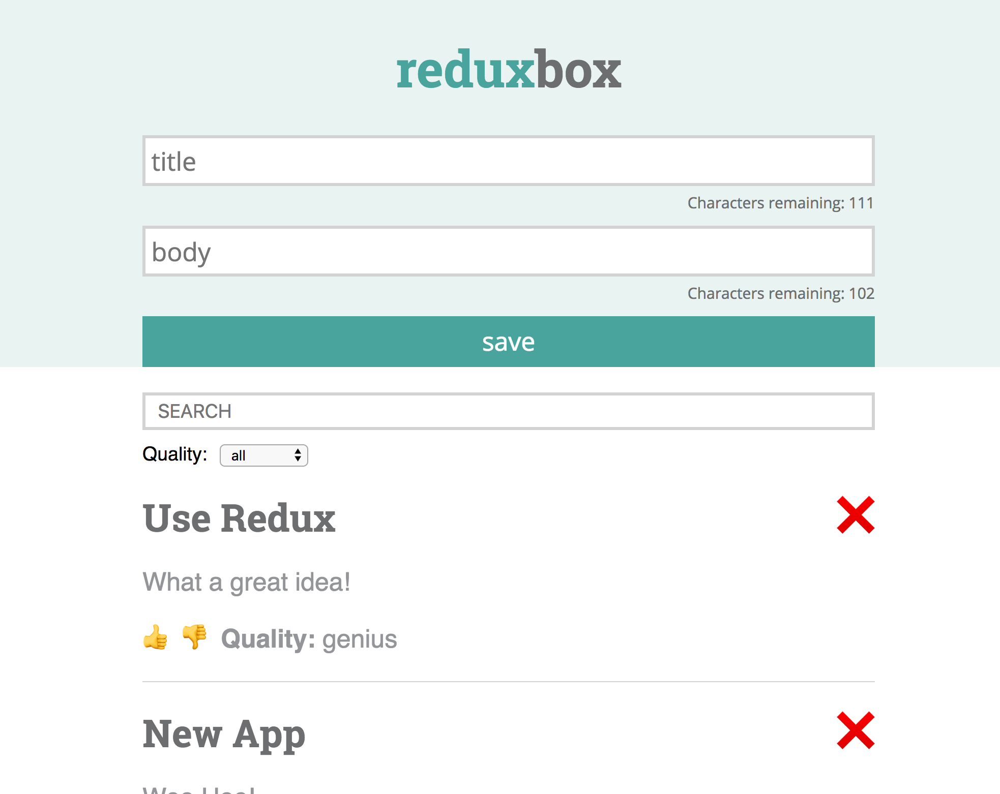

# reduxbox

This app serves as practice for building applications with react/redux and writing tests with jest and enzyme.

To start, clone down this repo and run `npm install` then `npm start`.

For a production build, run `npm run build`.

To run the test suite, run `npm test`.

To run the linter, run `npm run eslint`.

